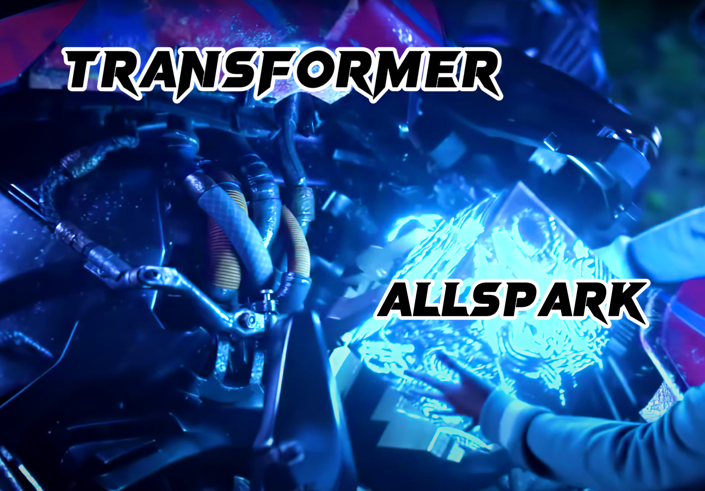

# [CVPR-2024] AllSpark: Reborn Labeled Features from Unlabeled in Transformer for Semi-Supervised Semantic Segmentation

This repo is the official implementation of AllSpark: Reborn Labeled Features from Unlabeled in Transformer for Semi-Supervised Semantic Segmentation which is accepted at CVPR-2024.


<p align="center">


</p>

The _**AllSpark**_ is a powerful Cybertronian artifact in the film series of _Transformers_. It was used to reborn Optimus Prime in _Transformers: Revenge of the Fallen_, which aligns well with our core idea.


## 1. Environment

First, clone this repo:

```shell
git clone https://github.com/xmed-lab/AllSpark.git
cd AllSpark/
```

Then, create a new environment and install the requirements:
```shell
conda create -n allspark python=3.7
conda activate allspark
pip install torch==1.12.0+cu116 torchvision==0.13.0+cu116 torchaudio==0.12.0 --extra-index-url https://download.pytorch.org/whl/cu116
pip install tensorboard
pip install six
pip install pyyaml
pip install -U openmim
mim install mmcv==1.6.2
pip install einops
pip install timm
```

## 2. Data Preparation & Pre-trained Weights

### 2.1 Pascal VOC 2012 Dataset
Download the dataset with wget:
```shell
wget https://hkustconnect-my.sharepoint.com/:u:/g/personal/hwanggr_connect_ust_hk/EcgD_nffqThPvSVXQz6-8T0B3K9BeUiJLkY_J-NvGscBVA\?e\=2b0MdI\&download\=1 -O pascal.zip
unzip pascal.zip
```

### 2.2 Cityscapes Dataset
Download the dataset with wget:
```shell
wget https://hkustconnect-my.sharepoint.com/:u:/g/personal/hwanggr_connect_ust_hk/EWoa_9YSu6RHlDpRw_eZiPUBjcY0ZU6ZpRCEG0Xp03WFxg\?e\=LtHLyB\&download\=1 -O cityscapes.zip
unzip cityscapes.zip
```

### 2.3 COCO Dataset
Download the dataset with wget:
```shell
wget https://hkustconnect-my.sharepoint.com/:u:/g/personal/hwanggr_connect_ust_hk/EXCErskA_WFLgGTqOMgHcAABiwH_ncy7IBg7jMYn963BpA\?e\=SQTCWg\&download\=1 -O coco.zip
unzip coco.zip
```


Then your file structure will be like:

```
├── VOC2012
    ├── JPEGImages
    └── SegmentationClass
    
├── cityscapes
    ├── leftImg8bit
    └── gtFine
    
├── coco
    ├── train2017
    ├── val2017
    └── masks
```

Next, download the following [pretrained weights](https://hkustconnect-my.sharepoint.com/:f:/g/personal/hwanggr_connect_ust_hk/Eobv9tk6a6RJqGXEDm2D_TcB2mEn4r2-BLDkotZHkd2l6w?e=fJBy7v).
```
├── ./pretrained_weights
    ├── mit_b2.pth
    ├── mit_b3.pth
    ├── mit_b4.pth
    └── mit_b5.pth
```

For example, mit-B5:
```shell
mkdir pretrained_weights
wget https://hkustconnect-my.sharepoint.com/:u:/g/personal/hwanggr_connect_ust_hk/ET0iubvDmcBGnE43-nPQopMBw9oVLsrynjISyFeGwqXQpw?e=9wXgso\&download\=1 -O ./pretrained_weights/mit_b5.pth
```


## 3. Training & Evaluating

```bash
# use torch.distributed.launch
sh scripts/train.sh <num_gpu> <port>
# to fully reproduce our results, the <num_gpu> should be set as 4 on all three datasets
# otherwise, you need to adjust the learning rate accordingly

# or use slurm
# sh scripts/slurm_train.sh <num_gpu> <port> <partition>
```

To train on other datasets or splits, please modify
``dataset`` and ``split`` in [train.sh](https://github.com/xmed-lab/AllSpark/blob/main/scripts/train.sh).


## 4. Results


Model weights and training logs will be released soon.


## Citation

If you find this project useful, please consider citing:

```bibtex
@inproceedings{allspark,
  title={Revisiting Weak-to-Strong Consistency in Semi-Supervised Semantic Segmentation},
  author={Wang, Haonan and Zhang, Qixiang and Li, Yi and Li, Xiaomeng},
  booktitle={CVPR},
  year={2024}
}
```


## Acknowlegement
AllSpark is built upon [UniMatch](https://github.com/LiheYoung/UniMatch) and [SegFormer](https://github.com/NVlabs/SegFormer). We thank their authors for making the source code publicly available.


